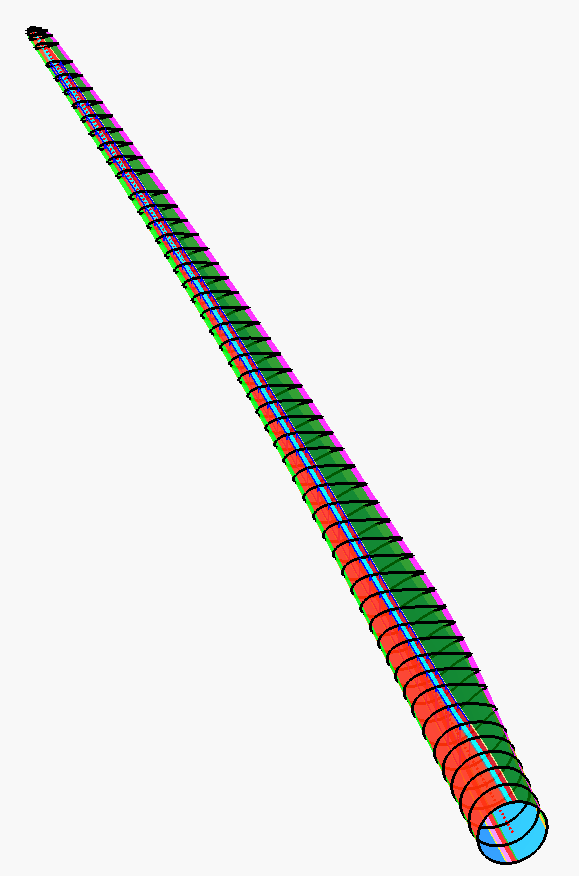

# UTD IEA 15 MW Blade Model

- The UTD IEA 15 MW blade model created by [Griffith's group](https://labs.utdallas.edu/griffith/) is contained in this repository. 
- The UTD IEA 15 MW blade model was created using the modeling tool [NuMAD v2.0](https://github.com/sandialabs/NuMAD/releases/tag/v2.0) based on the original open-source [IEA 15 MW reference wind turbine blade design](https://www.nrel.gov/docs/fy20osti/75698.pdf). The UTD IEA 15 MW blade model was created to increase the body of knowledge on large-scale wind turbines and provide one more resource to the wind energy community that can be used as reference for future studies. 
- Detailed documentation of the blade structure and baseline structural analysis of the UTD IEA 15 MW blade model was presented at the AIAA SciTech 2023 conference. The conference paper and a video presentation can be accessed here https://arc.aiaa.org/doi/10.2514/6.2023-2093. 
- Please see the [GitHub Repo Citation](#github-repo-citation) and [Conference Paper Citation](#conference-paper-citation) sections below for the appropriate citation for this work. 

# Repo Contents
The following summarizes the contents in this repo:
- NuMAD model: 
   - NuMAD_utd_iea15mw.xlsx : Primary input file for NuMAD v2.0 spreadsheet that contains the blade model data (detailed geometry, materials, layup information, and bill of materials summary). 
   - utd_iea15mw.nmd : NuMAD model file using NuMAD v2.0 with input from the NuMAD_utd_iea15ms.xlsx spreadsheet. 
   - MatDBsi.txt : NuMAD materials database containing the material and laminate property information. 
   - "airfoils" folder : Contains set of files with the NuMAD airfoil geometry coordinates used to model the blade. 
- Useful output files: 
  - shell7.src : ANSYS input file generated by NuMAD to create a finite element model of the blade. 
  - utd_iea15mw.p3d : Blade external geometry file in Plot 3D file format. 
  - utd_iea15mw.iges : Blade external geometry exported from ANSYS for CAD modeling. Contains surfaces of the outer moldline of the blade and shear webs. 
  - utd_iea15mw_ElastoDynBlade_ratedrpm.dat: OpenFAST ElastoDyn blade file with mode shapes at rated rpm. 
- Additional outputs from PreComp and BModes: 
  - PreComp_SectionData.mat : Output MATLAB structure that contains a full set of cross-sectional blade properties generated by PreComp. 
  - bmodes_0rpm.out : BModes output file that contains the blade frequencies and mode shapes for parked conditions (0 rpm).

# Conference Paper Contents
The conference paper contains the following: 
- Methodology: 
  - Blade model creation and analysis process. 
  - Design and analysis software. 
  - Conversion of blade model from WISDEM to NuMAD. 
- Blade characteristics: 
  - Visualization of blade model and distributed properties. 
  - Blade mass and bill of materials (BOM). 
  - Modal properties.
- Detailed structural analysis:
  - Design load case (DLC) analysis. 
  - Baseline structural analysis: Deflection, strength, fatigue, buckling, and flutter. 
  - Blade model score card. 

# Point of Contact
- Alejandra S. Escalera Mendoza: ase180001@utdallas.edu
- D. Todd Griffith: tgriffith@utdallas.edu

# GitHub Repo Citation
If you use this model in your research or publications, please cite using the following:  
 
    @misc{github_utd_iea15mwblade_v1,
    title = {UTD-IEA15MWBlade},
    author = {Escalera Mendoza, Alejandra S. and Mishra, Ipsita and Griffith, D. Todd},
    doi = {10.5281/zenodo.7392283},
    version = {1.0.0},
    month = {12},
    year = {2022},
    url = {https://github.com/UTDGriffithLab/UTD-IEA15MWBlade},
    }

# Conference Paper Citation
Please use the following for citing the conference paper that details the development of the UTD IEA 15 MW blade model and its detailed baseline structural analysis: 

Escalera Mendoza, A.S., Mishra, I., Griffith, D.T., "An Open-Source NuMAD Model for the IEA 15 MW Blade with Baseline Structural Analysis," AIAA Scitech 2023 Forum, American Institute of Aeronautics and Astronautics, National Harbor, Maryland, 2023. 

    @inproceedings{UTD_IEA15MW_blademodel,
    title = {{An Open-Source NuMAD Model for the IEA 15 MW Blade with Baseline Structural Analysis}},
    author = {Escalera Mendoza, Alejandra Stefania and Mishra, Ipsita and Griffith, D. Todd},
    publisher = {American Institute of Aeronautics and Astronautics},
    booktitle = {{AIAA} {Scitech} 2023 {Forum}},
    address = {National Harbor, Maryland},
    doi = {https://doi.org/10.2514/6.2023-2093},
    month = jan,
    year = {2023}
    }
